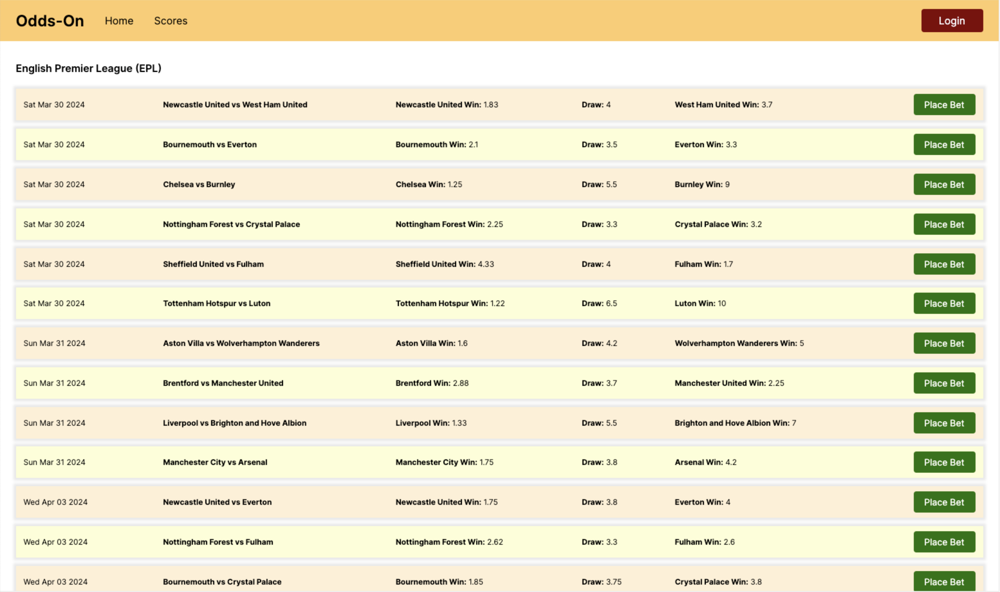
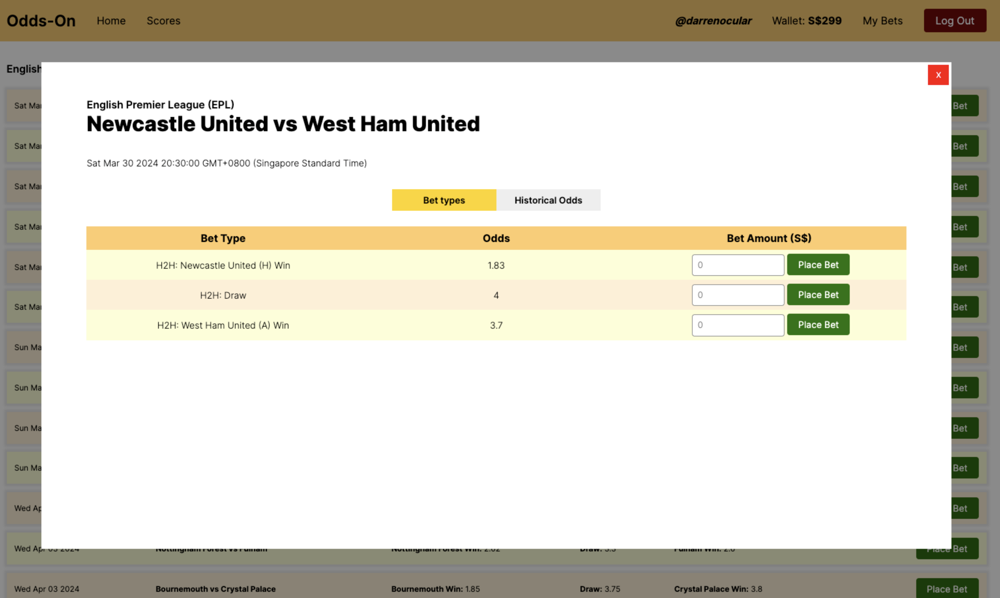
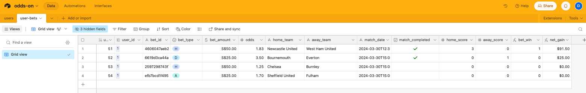
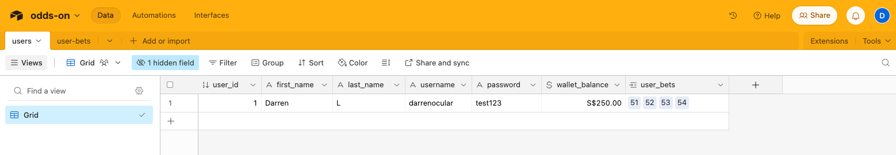
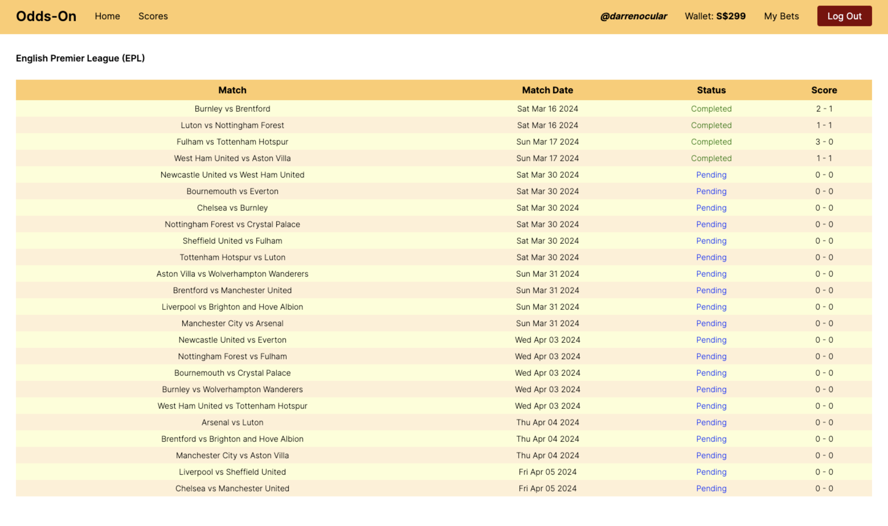
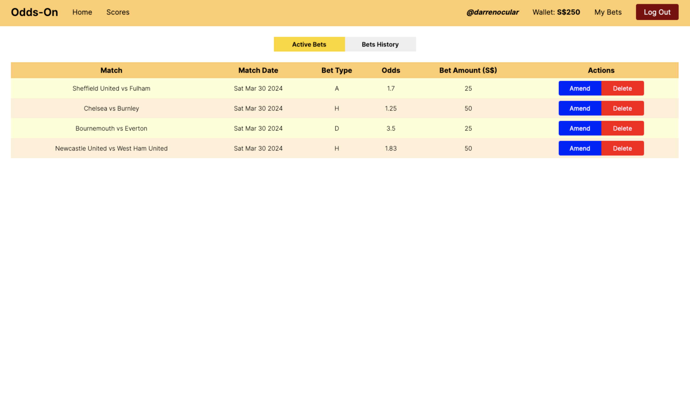
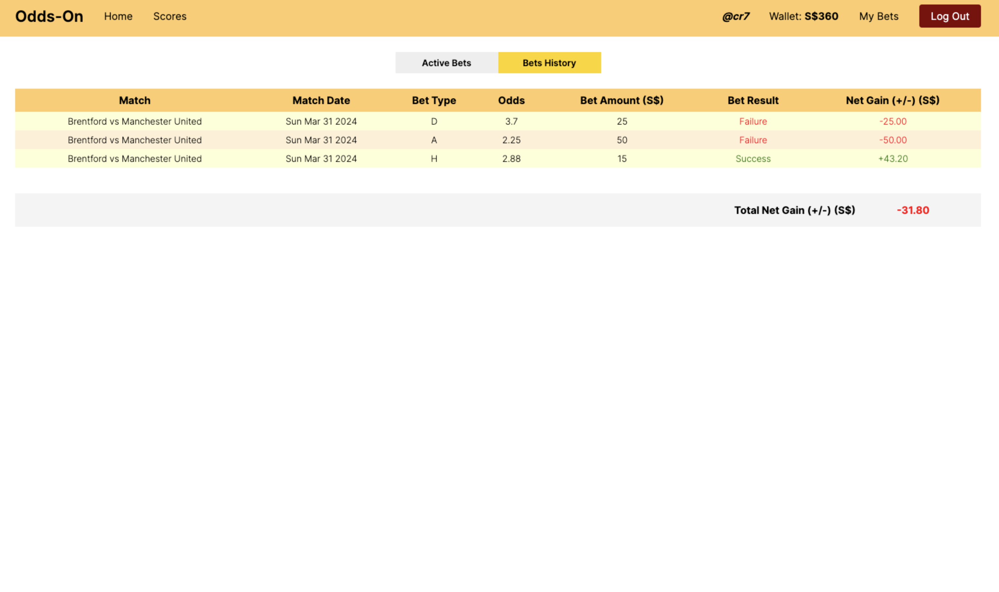
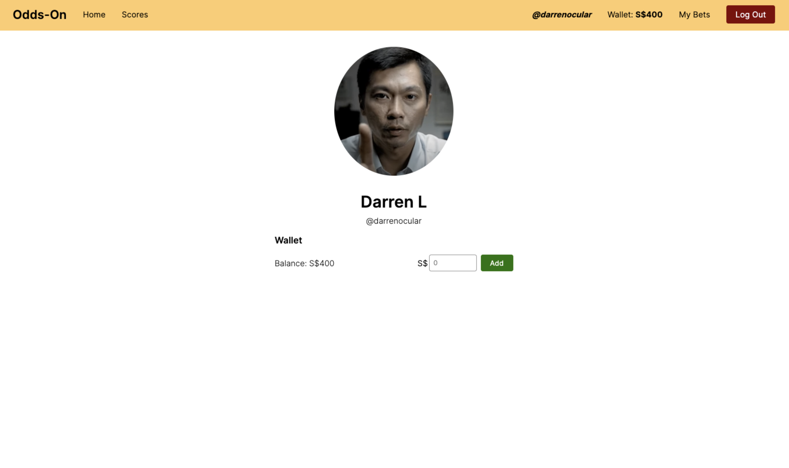

# Odds-On

## Introduction

A sports betting platform displaying live odds for your favourite matches built on React.

## Technology

- HTML
- CSS
- JavaScript
- React
- Airtable (to store data on users and users' bets)
- Postman (for development phase)

## Getting Started

Odds-On is a sports betting aggregator that fetches data on upcoming and past matches, including live odds from various bookmakers across the world, from the [Odds Api](https://the-odds-api.com/). This data is available to all.



Essentially, the Odds API has 2 endpoints of particular interest: `/scores` and `/odds`. For ease of reference, snippets of the JSON data fetched from the respective endpoints are as follows:

- /scores

  ```
  [
    {
        "id": "a129f11bf34fb47d466a643a3c9f5ceb",
        "sport_key": "soccer_epl",
        "sport_title": "EPL",
        "commence_time": "2024-03-16T15:00:11Z",
        "completed": true,
        "home_team": "Burnley",
        "away_team": "Brentford",
        "scores": [
            {
                "name": "Burnley",
                "score": "2"
            },
            {
                "name": "Brentford",
                "score": "1"
            }
        ],
        "last_update": "2024-03-17T14:16:07Z"
    }, ...
  ]
  ```

- /odds

  ```
  [
    {
        "id": "4606047aeb27e6856b3ff293ec578e43",
        "sport_key": "soccer_epl",
        "sport_title": "EPL",
        "commence_time": "2024-03-30T12:30:00Z",
        "home_team": "Newcastle United",
        "away_team": "West Ham United",
        "bookmakers": [
            {
            "key": "paddypower",
            "title": "Paddy Power",
            "last_update": "2024-03-19T01:05:59Z",
            "markets": [{
                    "key": "h2h",
                    "last_update": "2024-03-19T01:05:59Z",
                    "outcomes": [
                        {
                            "name": "Newcastle United",
                            "price": 1.75
                        },
                        {
                            "name": "West Ham United",
                            "price": 3.8
                        },
                        {
                            "name": "Draw",
                            "price": 4
                        }
                    ]
            }]}
        ]
    }, ...
  ]
  ```

To start, users can register for an account with Odds-On and/or log in to an existing account to place bets. All users have a virtual wallet, which can be topped up, to be used for placing bets on the platform.

### Live Odds

The live odds page displays the various bet types and corresponding odds for each match. Logged in users can click "Place Bet" to toggle a pop-up displaying further details for each match.



Users can then key in how much they would like to bet on a particular outcome. If the bet amount is more than the user's wallet balance, the bet will not go through.

Once a bet is successfully placed, a "POST" call to the "user-bets" table in Airtable will be made, creating a new record with details of the bet. This record will be tagged to the logged in user who placed the bet (see column "user_id" in "user-bets" table); the "users" table will also show the bets that are tagged to each particular user (see column "user_bets"). The user's wallet will be drawn down by the corresponding bet amount.





### (Live) Scores

The live scores page displays all the scores of upcoming, ongoing and recent matches (up to 3 days ago), fetched from the /scores endpoint of the Odds API (as above).



The data fetched from the /scores endpoint has a "completed" key for each match that contains a boolean value - `true` if the match has completed and `false` if the match has not completed. For each match that has completed, the "scores" key will contain the final scores of the match.

The /scores data are stored in a "scores" state, which upon change triggers a `useEffect()` hook that updates the "user-bets" table in Airtable accordingly (e.g., "bet_win" and "net_gain" columns will populate based on formulas coded in Airtable).

This will also update the "userBets" state in the code, which affects the User's Bets page as below.

### User's Bets

The user bets page displays all the bets that the user has made. There are 2 views.

- An "active bets" view that shows all bets made by the user for games that have yet to complete; and
- A "bets history" view that shows all bets made by the user, including outcomes and net gains for such bets, for games that have completed.



For active bets, the user has the ability to amend and/or delete any of the listed bets, until a match commences. Once a match is completed, the bet details for that match will be moved to the bets history display.



### Profile

The user's profile page will display the user's wallet balance and allow the user to add funds to his/her wallet. For future enhancements, statistics of the user's betting pedigree (assessed based on successful bets) will be displayed.



## Next Steps (Icebox)

For the purposes of this MVP, we have:

- Restricted matches to the English Premier League (EPL) and odds provided from Paddy Power UK; and
- Restricted bet types to head-to-head (H2H) outcomes to limit the bet types displayed.

For further development, we will:

- Expand the scope of matches and bookmakers available on the platform so that users have a wider pool of matches to bet on and bookmakers to place bets with;
- Display mid-game odds for all matches so that users have the ability to make additional bets mid-game;
- Display historical odds for all matches to allow users the ability to make informed betting decisions;
- Gather betting statistics for each user (e.g., % of bets won, etc.); and
- Profile users based on betting strategy/behaviour.

## References/Resources

- The Odds API documentation: https://the-odds-api.com/liveapi/guides/v4/#overview
- Wireframes: https://www.figma.com/file/drmo06YLo0u2j3ZLclobAx/Odds-On?type=design&node-id=0-1&mode=design&t=mJH56NstIlkdzAZR-0
- Public board: https://github.com/users/darrenocular/projects/2/views/1
